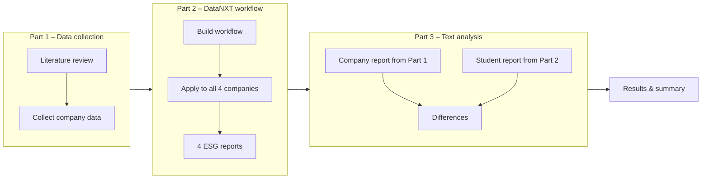
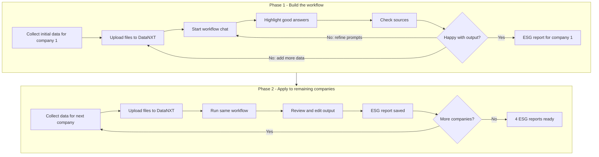

# Financial Data Analytics in Python

**Prof. Dr. Fabian Woebbeking**</br>
Assistant Professor of Financial Economics

IWH – Leibniz Institute for Economic Research</br>
MLU – Martin Luther University Halle-Wittenberg

fabian.woebbeking@iwh-halle.de


## Case Study: AI-Assisted ESG Report Generation and Text Analysis

The overarching goal of this case study is to combine modern AI-assisted workflows with classical and LLM-based text analysis techniques.

You will be assigned **four companies**. Your first task is to get to know these companies — who they are, what they do, and how they position themselves on ESG topics. You will then build a single reusable AI workflow that generates an ESG report, and apply it to all four companies. Finally, you will compare the AI-generated reports to the companies' actual published ESG or sustainability disclosures using text analysis in Python.

Guidance is provided in class, through dedicated tutorial sessions and on the course's [GitHub discussion board](https://github.com/cafawo/FinancialDataAnalytics/discussions). Please also note that you find plenty of guidance on the internet, including Wikipedia, YouTube and ChatGPT.

Before submission there is a **graded mandatory presentation** where you present the current state of your work. After the presentation you have sufficient time to incorporate any feedback into your work before submitting the final deliverable.

The **final deliverable** of this case study is a summary of your methodology, results, and critical reflections in a `results/README.md` file. The summary should be concise, clearly written, and grounded in both your empirical findings and relevant academic or industry literature. If applicable, state possible limitations of your study. Also ensure that your code is in working condition, properly documented, and that you use best practices for agentic AI where applicable.

> ** As always, everything is submitted through GitHub, including your presentation, code and case solution. Please commit and push often in order to save your work. The final state of the repository after the deadline has passed matters for your grade. All **deadlines are published on the [course website](https://wbk.ing/FinancialDataAnalytics/)**.

The diagram below gives an overview of the three parts and how they connect:




### Your Company Assignments

You will be assigned four companies individually. As part of your analysis, you are expected to research and reflect on how these companies relate to one another — sectoral similarities and differences may turn out to be relevant when interpreting your results.

Please **select one primary company** out of these four. This company will be the corner stone of your analysis and allows you to reduce redundancies to a minimum. This is, you should explain your approach once and for the primary company. You should also tailor your approach to this company. The other three companies should receive the same analysis as the primary company. In your results you can then discuss if this ``one size fits all'' approach is actually sufficient for ESG analysis.


### Part 1: Data Collection

#### Literature Review and Hypothesis Development

Before collecting any data, conduct a brief literature review on ESG reporting. What do environmental, social, and governance disclosures actually measure? What frameworks exist (e.g. GRI, TCFD, SASB, EU CSRD)? What determines the quality and comprehensiveness of ESG reports? Use your findings to develop expectations about what a meaningful ESG report should contain and which data sources are most relevant.

Consider the following questions:

* What key metrics are typically reported for E, S, and G?
* How do reporting frameworks differ across industries and geographies?
* What are the known limitations of voluntary ESG disclosures?

#### Identifying and Collecting Data

##### 1. Input data for your DataNXT workflow

For each of your four companies, collect data that will serve as the factual basis for your AI-generated ESG report. You should aim for broad coverage of all three ESG pillars. Below are suggested sources:

**Financial filings and official disclosures**
* For US-listed companies for instance check: SEC EDGAR (https://www.sec.gov/cgi-bin/browse-edgar) annual reports (10-K), quarterly reports (10-Q).
* For German companies: the Bundesanzeiger (https://www.bundesanzeiger.de) for annual financial statements; company investor relations pages for non-financial reports.
* Company websites often host additional useful material such as press releases, investor presentations, and dedicated sustainability portals with TCFD reports, GRI indices, and UN Global Compact communications.

**ESG-specific databases and ratings**
* Yahoo Finance (https://finance.yahoo.com) provides basic ESG risk scores under the "Sustainability" tab for many listed companies.
* Sustainalytics and MSCI ESG offer some publicly accessible summary ratings.
* CDP (https://www.cdp.net) publishes climate-related disclosures for thousands of companies.

**News and media**
* Google News or financial news aggregators (e.g. Reuters, Bloomberg, Handelsblatt for German firms) can reveal recent ESG controversies, lawsuits, regulatory actions, or sustainability initiatives.
* The RepRisk platform provides ESG risk intelligence.

To be able to upload your data on DataNXT your input data should be in one of the following formats: PDF, IMAGE, DOCX, HTML, PPTX, ASCIIDOC, or MARKDOWN. Document your data sources carefully and keep them in your repository (or link to them if file sizes are too large).

> **Important:** The company's actual ESG or sustainability report **must not** be used as an input to your DataNXT workflow. The purpose of this case study is to generate an ESG report from independent data sources and then compare it to the official report.

##### 2. Official ESG reports for comparison

In addition to the input data above, you need to locate each company's official ESG or sustainability report. This is the document you will compare your AI-generated report against in Part 3. Company websites are the most reliable place to find these — look for a dedicated "Sustainability", "ESG", or "Corporate Responsibility" section, typically under the investor relations or about pages. Most large listed companies publish a standalone sustainability report or include a substantive ESG section in their annual report, freely available as a PDF.


### Part 2: AI-Assisted ESG Report Generation with DataNXT

#### Introduction to DataNXT

[DataNXT](https://datanxt.de/) is a no-code AI workflow tool that enables you to build and run structured, repeatable AI tasks — known as *workflow chats*. A workflow chat is a multi-step conversation with a large language model where each step can be pre-configured with a prompt, and outputs from one step can feed into the next. DataNXT also shows the sources underlying each response, and allows you to review, edit, and approve answers at each stage before proceeding.

> **Example files:** The `examples/` folder in this repository contains a set of Deutsche Bank documents that were used as a reference run. These illustrate the type and format of files you should upload to DataNXT as input for your workflow.

#### Building Your Workflow

Build a single workflow chat in DataNXT that produces an ESG report for a company. The report should cover all three pillars — Environmental, Social, and Governance — though the exact structure, depth, and framing are up to you. Some possible elements to include:

* **Environmental**: carbon emissions (Scope 1, 2, 3 if available), energy consumption, water usage, waste management, climate targets, environmental controversies.
* **Social**: workforce size and diversity, health and safety record, labor relations, supply chain standards, community engagement, product safety.
* **Governance**: board composition and independence, executive compensation, audit and risk oversight, anti-corruption policies, shareholder rights, regulatory compliance.

Your workflow should be designed to be **general enough to work across all four of your assigned companies** without being rebuilt from scratch for each one. Think carefully about how to prompt the workflow so that it produces meaningful, company-specific output while remaining reusable. This is a design challenge in itself — a workflow that is too generic may produce superficial reports, while one that is too tailored to a single company may not port well.

The diagram below illustrates how you first build and refine the workflow on one company, then apply it to the remaining three:



#### Applying the Workflow

Once you are satisfied with your workflow, apply it to the remaining three of your assigned companies and save each generated report in a consistent format.


### Part 3: Text Analysis in Python

The core analytical task is to compare your AI-generated ESG reports to the companies' actual published ESG or sustainability reports. This analysis should be conducted in Python, either in a Jupyter Notebook or as a `.py` script. The goal is not to declare one report "better" than the other, but to understand in what ways they differ — and to reflect on what those differences reveal.

Beyond the pairwise comparison of generated vs. actual reports, you should also think about **patterns across your four companies**. Are some companies easier for the workflow to cover than others? Do any of the companies seem more similar to each other in terms of ESG profile, reporting style, or text characteristics? Use your analysis to explore and explain any such structure you find.

You might want to consider two broad **methodological approaches**: classical text analysis (3.1) and LLMs (3.2). This is your research and the choice is yours; you can pick one, both, a combination, or a different type of analysis suitable for assessing the differences between the company's reporting and your own reports.

#### 3.1 Classical Text Analysis

Classical text analysis can provide simple quantitative comparisons between the official and AI-generated reports. Possible measures include:

* **Length and coverage**: word counts, sentence counts, average sentence length, and coverage of Environmental, Social, and Governance topics.
* **Vocabulary**: frequent non-stopwords, keyword overlap, and use of ESG-specific terms such as "Scope 3", "materiality", or "TCFD".
* **Sentiment**: overall tone and sentiment differences across ESG topics.
* **Similarity**: TF-IDF cosine similarity, Jaccard similarity of keyword sets, or topic modeling.

#### 3.2 LLM-Assisted Analysis

LLMs can help assess differences that are harder to capture with simple metrics. Possible dimensions include:

* **Factual consistency**: do the reports make conflicting claims?
* **Completeness**: which topics appear in one report but not the other?
* **Specificity**: which report is more concrete, company-specific, or quantified?
* **Framing**: does one report emphasize risks, achievements, controversies, or trade-offs more strongly?


### Repository Structure and Code

Your GitHub repository should be organized as follows:

```bash
esg_reporting/
├── data/                    # Raw collected data per company (text, PDFs, CSVs, etc.)
│   ├── company_a/
│   ├── company_b/
│   ├── company_c/
│   └── company_d/
├── examples/                # Example input files for DataNXT upload (Deutsche Bank)
├── reports/                 # ESG reports (AI-generated and actual)
│   ├── generated/           # Output from DataNXT workflow
│   └── actual/              # Official ESG/sustainability reports 
├── literature/              # Relevant academic papers and frameworks
├── README.md                # This file: case description and instructions
├── analysis.ipynb           # Jupyter Notebook (or .py) for text analysis
├── requirements.txt         # Python dependencies
└── results/
    └── README.md            # Summary of your findings
```

The structure above is a suggestion. You may deviate from it, but you must document your actual repository structure clearly in your README.md. If data files are too large to host on GitHub, use an external service (e.g. Dropbox) and include links in your README.


### Summary of Deliverables

All code and results must be submitted via GitHub as outlined in the [Syllabus](https://github.com/cafawo/FinancialDataAnalytics#how-to-submit-your-work). The exception are large data files, which can be hosted externally.

**Code:**
* Submit **executable** code.
* Guide us through your repository with a clear README.md and inline comments.
* Make sure (test) that your code can be executed.
* Provide a `requirements.txt` with all Python dependencies.

**Summary of Results (`results/README.md`) should include:**
* Literature: key references on ESG reporting frameworks and text analysis methods.
* Your findings from the text analysis (Part 3), with tables, figures, or metrics as appropriate.
* Economic intuition: what do the differences between AI-generated and actual ESG reports reveal about the nature of corporate ESG disclosure?
* Critical reflection: limitations of your data collection, your DataNXT workflow, and your text analysis.


### Presentation

In the final two sessions of the lecture, you will present your work to your peers. Each presentation should last approximately 15 minutes. Active participation during other students' presentations — through relevant questions and discussion — contributes to your participation score. Let's make it an interactive and engaging experience for everyone!

Best of luck!

**If you need more help, post a question on the [discussion board](https://github.com/iwh-halle/FinancialDataAnalytics/discussions) or contact the TA for this course.**